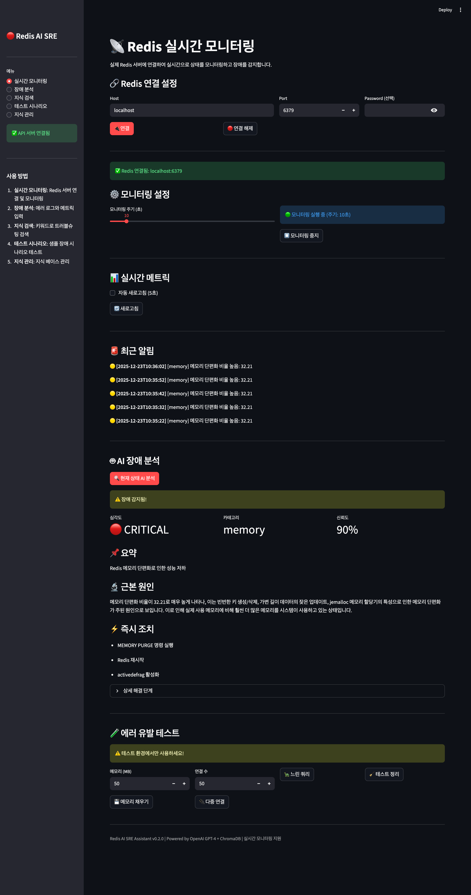
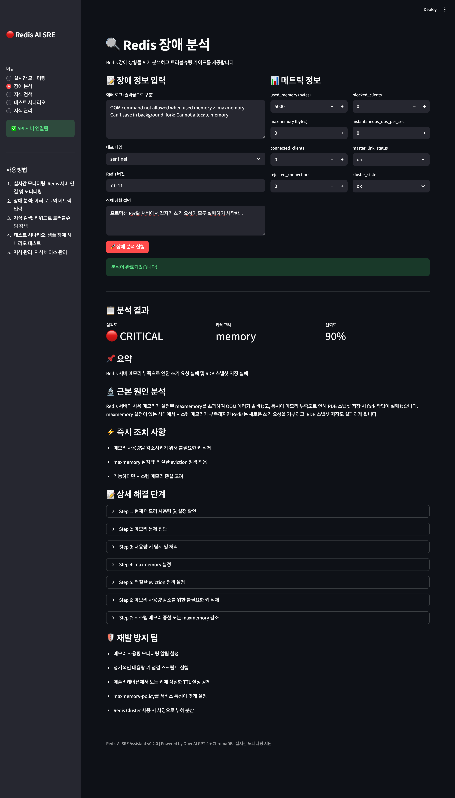

# Redis AI SRE Assistant - 프로젝트 보고서

**작성일**: 2025-12-23
**버전**: v0.2.0
**상태**: PoC 완료

---

## 1. 프로젝트 개요

### 1.1 목적
Redis 운영자의 장애 대응 노하우를 AI 기반 RAG(Retrieval-Augmented Generation) 시스템으로 구축하여, 실시간 장애 감지 및 자동화된 트러블슈팅 가이드를 제공하는 PoC 시스템 개발

### 1.2 주요 요구사항
- Redis 서버 장애 로그/메트릭 기반 AI 분석
- 운영 노하우를 RAG 지식 베이스로 구축
- 실제 Redis 서버 연동 및 실시간 모니터링
- 에러 유발 테스트를 통한 시스템 검증

### 1.3 기술 스택

| 구분 | 기술 | 버전 |
|------|------|------|
| Backend | Python + FastAPI | 3.11+ / 0.109+ |
| AI/LLM | OpenAI GPT-4 | API |
| Embedding | OpenAI text-embedding-3-small | API |
| Vector DB | ChromaDB (로컬) | 0.4.22+ |
| Frontend | Streamlit | 1.31+ |
| Redis Client | redis-py | 5.0+ |
| Container | Docker | Redis 7.2-alpine |

---

## 2. 시스템 아키텍처

```
┌─────────────────────────────────────────────────────────────────────┐
│                      Streamlit UI (포트 8501)                        │
│  ┌─────────────┐ ┌─────────────┐ ┌─────────────┐ ┌─────────────┐   │
│  │ 실시간 모니터링│ │  장애 분석   │ │  지식 검색   │ │  지식 관리   │   │
│  └─────────────┘ └─────────────┘ └─────────────┘ └─────────────┘   │
└────────────────────────────┬────────────────────────────────────────┘
                             │ HTTP
                             ▼
┌─────────────────────────────────────────────────────────────────────┐
│                    FastAPI Server (포트 8000)                        │
│  ┌──────────────┐ ┌──────────────┐ ┌──────────────┐ ┌────────────┐ │
│  │ /api/v1/     │ │ /api/v1/     │ │ /api/v1/     │ │ /api/v1/   │ │
│  │   analyze    │ │   knowledge  │ │   search     │ │   monitor  │ │
│  └──────────────┘ └──────────────┘ └──────────────┘ └────────────┘ │
└───────┬─────────────────┬─────────────────┬─────────────┬──────────┘
        │                 │                 │             │
        ▼                 ▼                 ▼             ▼
┌──────────────┐  ┌──────────────┐  ┌──────────────┐  ┌────────────┐
│  OpenAI API  │  │  ChromaDB    │  │  RAG Engine  │  │   Redis    │
│  (GPT-4)     │  │ (Vector DB)  │  │  (임베딩+검색) │  │  (Docker)  │
└──────────────┘  └──────────────┘  └──────────────┘  └────────────┘
```

---

## 3. 구현 내용

### 3.1 디렉토리 구조

```
ai-sre/
├── app/                          # 애플리케이션 코어
│   ├── api/                      # REST API 엔드포인트
│   │   ├── analyze.py            # 장애 분석 API
│   │   ├── knowledge.py          # 지식 관리 API
│   │   ├── search.py             # RAG 검색 API
│   │   └── monitor.py            # 실시간 모니터링 API (신규)
│   ├── core/                     # 핵심 비즈니스 로직
│   │   ├── llm.py                # OpenAI 클라이언트
│   │   ├── embeddings.py         # 임베딩 서비스
│   │   ├── rag.py                # RAG 엔진
│   │   └── redis_monitor.py      # Redis 모니터링 모듈 (신규)
│   ├── db/
│   │   └── vectorstore.py        # ChromaDB 연동
│   ├── models/
│   │   └── schemas.py            # Pydantic 스키마
│   ├── config.py                 # 환경 설정
│   └── main.py                   # FastAPI 엔트리포인트
├── knowledge/                    # 지식 베이스 데이터
│   └── troubleshooting/          # 트러블슈팅 가이드 (JSON)
│       ├── memory_issues.json
│       ├── connection_issues.json
│       ├── replication_issues.json
│       ├── cluster_issues.json
│       └── persistence_issues.json
├── tests/
│   ├── mock_data/
│   │   └── test_incidents.json   # 테스트 시나리오 8개
│   └── test_scenarios.py         # pytest 테스트
├── ui/
│   └── streamlit_app.py          # Streamlit 대시보드
├── scripts/
│   ├── init_db.py                # DB 초기화
│   └── load_knowledge.py         # 지식 로드
├── data/
│   └── chroma/                   # ChromaDB 영속 데이터
├── docker-compose.yml            # Redis 컨테이너 설정
├── requirements.txt              # Python 의존성
├── .env.example                  # 환경변수 템플릿
├── SPECIFICATION.md              # 상세 명세서
└── README.md                     # 프로젝트 설명
```

### 3.2 API 엔드포인트

#### 장애 분석 API
| Method | Endpoint | 설명 |
|--------|----------|------|
| POST | `/api/v1/analyze` | 장애 로그/메트릭 분석 |
| GET | `/api/v1/analyze/{id}` | 분석 결과 조회 |

#### 지식 관리 API
| Method | Endpoint | 설명 |
|--------|----------|------|
| POST | `/api/v1/knowledge` | 지식 추가 |
| GET | `/api/v1/knowledge` | 지식 목록 조회 |
| DELETE | `/api/v1/knowledge/{id}` | 지식 삭제 |
| POST | `/api/v1/knowledge/bulk-import` | 대량 임포트 |

#### 검색 API
| Method | Endpoint | 설명 |
|--------|----------|------|
| POST | `/api/v1/search` | RAG 검색 |
| GET | `/api/v1/search/similar` | 유사 장애 검색 |

#### 모니터링 API (신규)
| Method | Endpoint | 설명 |
|--------|----------|------|
| POST | `/api/v1/monitor/connect` | Redis 연결 |
| POST | `/api/v1/monitor/disconnect` | 연결 해제 |
| POST | `/api/v1/monitor/start` | 모니터링 시작 |
| POST | `/api/v1/monitor/stop` | 모니터링 중지 |
| GET | `/api/v1/monitor/status` | 상태 조회 |
| GET | `/api/v1/monitor/metrics` | 메트릭 조회 |
| GET | `/api/v1/monitor/alerts` | 알림 목록 |
| POST | `/api/v1/monitor/analyze` | 현재 상태 AI 분석 |
| POST | `/api/v1/monitor/test/fill-memory` | 메모리 테스트 |
| POST | `/api/v1/monitor/test/many-connections` | 연결 테스트 |
| POST | `/api/v1/monitor/test/slow-query` | 느린 쿼리 테스트 |
| POST | `/api/v1/monitor/test/cleanup` | 테스트 정리 |

### 3.3 RAG 지식 베이스

#### 등록된 지식 (10개)

| ID | 카테고리 | 제목 | 심각도 |
|----|----------|------|--------|
| kb-mem-001 | memory | Redis OOM 장애 대응 | critical |
| kb-mem-002 | memory | 메모리 단편화 문제 해결 | medium |
| kb-conn-001 | connection | Max Clients 초과 장애 대응 | high |
| kb-conn-002 | connection | 연결 타임아웃 문제 해결 | high |
| kb-repl-001 | replication | 복제 지연 문제 해결 | high |
| kb-repl-002 | replication | Full Resync 반복 문제 | high |
| kb-cluster-001 | cluster | Cluster 노드 장애 대응 | critical |
| kb-cluster-002 | cluster | MOVED/ASK 리다이렉션 문제 | medium |
| kb-persist-001 | persistence | RDB 스냅샷 저장 실패 해결 | high |
| kb-persist-002 | persistence | AOF Rewrite 실패 해결 | high |

#### 지식 구조
```json
{
  "id": "kb-mem-001",
  "category": "memory",
  "title": "Redis OOM 장애 대응",
  "symptoms": ["증상 목록"],
  "root_causes": ["근본 원인"],
  "diagnosis_steps": ["진단 절차"],
  "solutions": ["해결 방법"],
  "prevention": ["예방 조치"],
  "related_metrics": ["관련 메트릭"],
  "severity": "critical",
  "tags": ["memory", "OOM"]
}
```

### 3.4 테스트 시나리오

| ID | 장애 유형 | 심각도 | 예상 카테고리 |
|----|----------|--------|--------------|
| SC-001 | OOM (Out of Memory) | Critical | memory |
| SC-002 | Max Clients 초과 | High | connection |
| SC-003 | Replication Lag | High | replication |
| SC-004 | Cluster Node Failure | Critical | cluster |
| SC-005 | Slow Query | Medium | performance |
| SC-006 | AOF Rewrite Failure | High | persistence |
| SC-007 | RDB Save Failure | High | persistence |
| SC-008 | Connection Timeout | Medium | connection |

### 3.5 실시간 모니터링 기능

#### 수집 메트릭
- **메모리**: used_memory, maxmemory, fragmentation_ratio, evicted_keys
- **연결**: connected_clients, blocked_clients, rejected_connections
- **성능**: instantaneous_ops_per_sec, keyspace_hits/misses, hit_rate
- **영속성**: rdb_last_bgsave_status, aof_last_bgrewrite_status
- **복제**: role, connected_slaves, master_link_status
- **서버**: redis_version, uptime, cluster_enabled

#### 알림 임계값
| 항목 | 경고 | 위험 |
|------|------|------|
| 메모리 사용률 | 80% | 90% |
| 연결 클라이언트 | 1,000 | 5,000 |
| 거부된 연결 | - | 10/주기 |
| 차단된 클라이언트 | 50 | - |
| RDB 저장 | - | 실패 |
| AOF rewrite | - | 실패 |
| 복제 연결 | - | down |
| 메모리 단편화 | 1.5 | - |

---

## 4. 실행 환경

### 4.1 사전 요구사항
- Python 3.11+
- Docker Desktop
- OpenAI API Key

### 4.2 설치 및 실행

```bash
# 1. 가상환경 생성 및 활성화
python -m venv venv
source venv/bin/activate

# 2. 의존성 설치
pip install -r requirements.txt

# 3. 환경변수 설정
cp .env.example .env
# .env 파일에 OPENAI_API_KEY 입력

# 4. DB 초기화 및 지식 로드
python scripts/init_db.py
python scripts/load_knowledge.py

# 5. Redis 컨테이너 실행
docker-compose up -d

# 6. API 서버 실행
uvicorn app.main:app --reload --port 8000

# 7. Streamlit UI 실행 (별도 터미널)
streamlit run ui/streamlit_app.py --server.port 8501
```

### 4.3 접속 정보
| 서비스 | URL |
|--------|-----|
| Streamlit UI | http://localhost:8501 |
| FastAPI Docs | http://localhost:8000/docs |
| Redis | localhost:6379 |

---

## 5. 테스트 결과

### 5.1 Redis 연결 테스트
```bash
$ curl -X POST "http://localhost:8000/api/v1/monitor/connect" \
  -H "Content-Type: application/json" \
  -d '{"host":"localhost","port":6379}'

{
  "status": "connected",
  "host": "localhost",
  "port": 6379,
  "message": "Redis 서버에 연결되었습니다"
}
```

### 5.2 메트릭 수집 테스트
```bash
$ curl "http://localhost:8000/api/v1/monitor/metrics"

{
  "used_memory": 414976,
  "used_memory_human": "405.25K",
  "maxmemory": 104857600,
  "maxmemory_human": "100.00M",
  "memory_usage_percent": 0.4,
  "connected_clients": 1,
  "instantaneous_ops_per_sec": 0,
  "redis_version": "7.2.12",
  "rdb_last_bgsave_status": "ok",
  "aof_last_bgrewrite_status": "ok",
  ...
}
```

### 5.3 에러 유발 테스트

#### 메모리 채우기 (OOM 유발)
```bash
$ curl -X POST "http://localhost:8000/api/v1/monitor/test/fill-memory?size_mb=100"

{
  "status": "error_triggered",
  "message": "예상된 에러 발생: OOM command not allowed...",
  "error_type": "OOM"
}
```

### 5.4 지식 베이스 로드
```
📁 발견된 지식 파일: 5개
✅ kb-mem-001: Redis OOM (Out of Memory) 장애 대응
✅ kb-mem-002: Redis 메모리 단편화(Fragmentation) 문제 해결
✅ kb-conn-001: Redis Max Clients 초과 장애 대응
✅ kb-conn-002: Redis 연결 타임아웃 문제 해결
✅ kb-repl-001: Redis 복제 지연(Replication Lag) 문제 해결
✅ kb-repl-002: Redis 복제본 Full Resync 반복 문제
✅ kb-persist-001: Redis RDB 스냅샷 저장 실패 문제 해결
✅ kb-persist-002: Redis AOF Rewrite 실패 및 파일 비대화 문제
✅ kb-cluster-001: Redis Cluster 노드 장애 대응
✅ kb-cluster-002: Redis Cluster MOVED/ASK 리다이렉션 과다 문제

📊 로드 결과:
  - 성공: 10개
  - 실패: 0개
  - 총 문서 수: 10개
```

---

## 6. 주요 기능 스크린샷 설명

### 6.1 실시간 모니터링 화면



- Redis 연결 설정 (Host, Port, Password)
- 모니터링 주기 설정 (5~60초)
- 실시간 메트릭 대시보드
  - 메모리 사용률 (%)
  - 연결 클라이언트 수
  - OPS/초
  - 히트율 (%)
- 서버 정보 및 영속성 상태
- 최근 알림 목록
- AI 장애 분석 버튼
- 에러 유발 테스트 패널

### 6.2 장애 분석 화면



- 에러 로그 입력
- 메트릭 정보 입력
- AI 분석 결과
  - 심각도, 카테고리, 신뢰도
  - 요약 및 근본 원인 분석
  - 즉시 조치 사항
  - 상세 해결 단계 (명령어 포함)
  - 재발 방지 팁

---

## 7. 향후 개선 사항

### 7.1 단기 과제
- [ ] 알림 채널 연동 (Slack, Email)
- [ ] 분석 히스토리 영속화 (DB 저장)
- [ ] 다중 Redis 인스턴스 지원
- [ ] Sentinel/Cluster 모드 자동 감지

### 7.2 중기 과제
- [ ] Prometheus/Grafana 연동
- [ ] 자동 복구 스크립트 실행
- [ ] 장애 예측 모델 (ML)
- [ ] 팀 협업 기능 (장애 대응 히스토리)

### 7.3 장기 과제
- [ ] 다중 LLM 지원 (Claude, Gemini)
- [ ] 온프레미스 LLM 옵션
- [ ] Kubernetes 배포 지원
- [ ] 엔터프라이즈 기능 (RBAC, 감사 로그)

---

## 8. 결론

본 PoC는 Redis 운영자의 트러블슈팅 노하우를 AI 기반 RAG 시스템으로 성공적으로 구현하였습니다.

### 주요 성과
1. **RAG 기반 지식 시스템**: 10개의 트러블슈팅 가이드를 벡터 DB에 임베딩하여 유사 사례 검색 구현
2. **실시간 모니터링**: 실제 Redis 서버 연동 및 사용자 설정 주기 모니터링
3. **자동 장애 감지**: 메모리, 연결, 영속성 등 주요 지표 임계값 기반 알림
4. **AI 분석 통합**: OpenAI GPT-4를 활용한 장애 원인 분석 및 해결책 제시
5. **에러 유발 테스트**: OOM, Max Clients 등 실제 장애 시나리오 검증

### 활용 방안
- 신규 Redis 운영자 온보딩 도구
- 장애 대응 SOP 자동화
- 운영 노하우 축적 및 공유 플랫폼
- 24/7 자동 모니터링 시스템 기반

---

**문서 끝**
